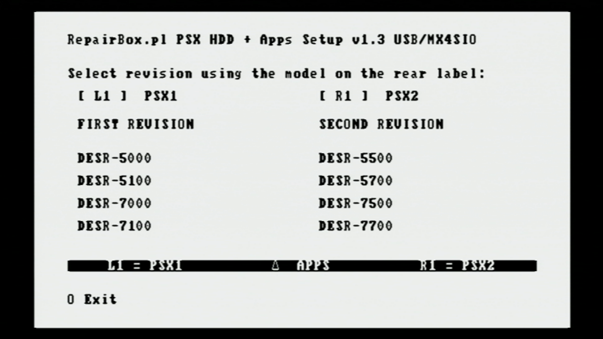
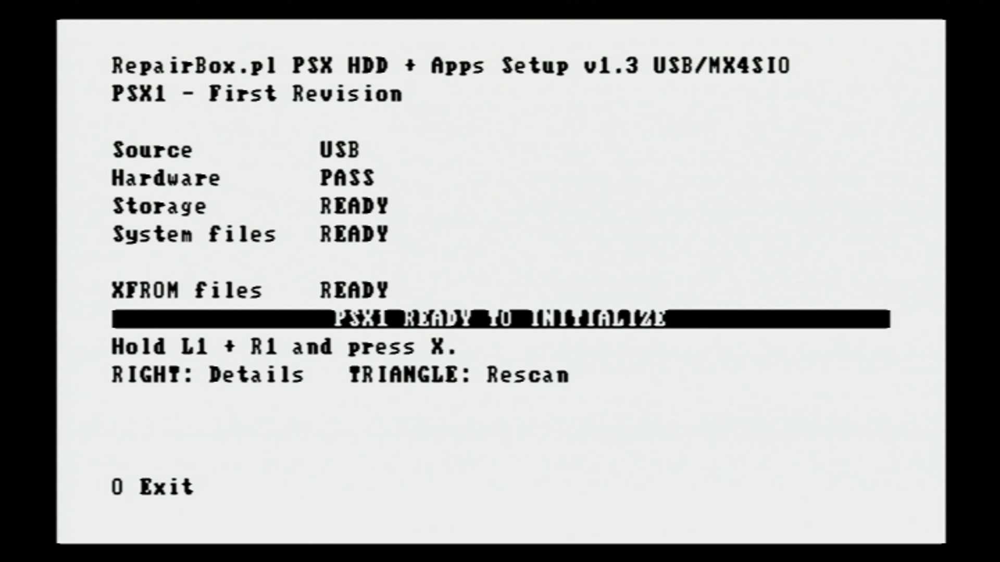
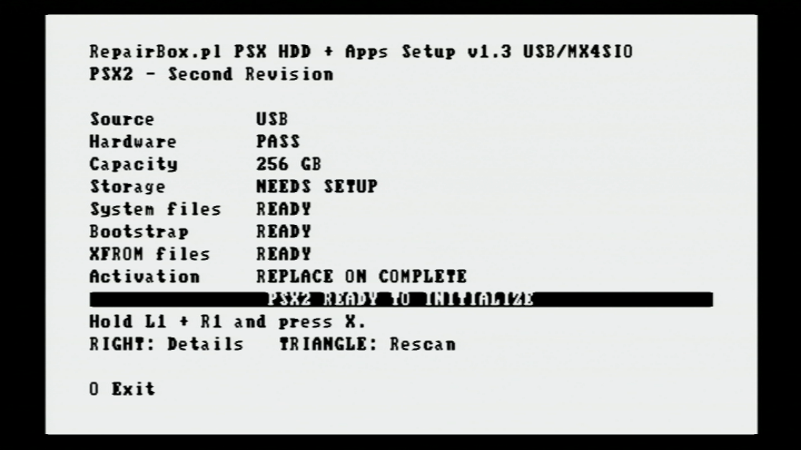
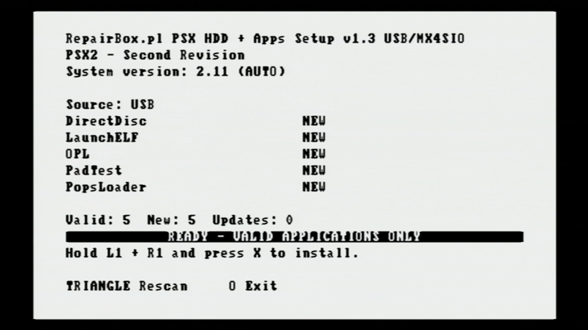
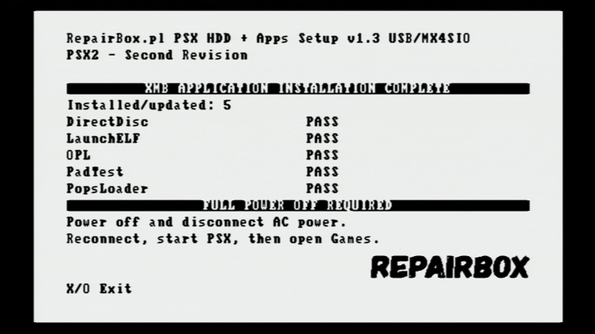

# RepairBox.pl PSX HDD + Apps Setup v1.3

RepairBox.pl PSX HDD + Apps Setup prepares replacement storage for Sony PSX
DESR consoles. It supports both PSX hardware revisions and is designed
primarily for the RepairBox FC1307A IDE-to-SD adapter.

The installer can rebuild the PSX1 or PSX2 system, restore the matching XFROM
files, and install PS2 ELF applications in the Games section of XMB.

> **Warning:** system installation is destructive. Confirming PSX1 or PSX2
> setup erases and rebuilds the attached PSX storage device. Back up important
> data and do not disconnect power or the source medium while writing.

## Video guide

A complete video showing the PSX2 update and the HDD Setup workflow is
available on YouTube:

[](https://youtu.be/gVhUV-QnHn4)

[Watch the RepairBox PSX HDD Setup video on YouTube](https://youtu.be/gVhUV-QnHn4)

The video demonstrates storage preparation and the differences between the
PSX1 and PSX2 installation paths.

## Complete packages

Choose the package matching the language of the system you want to install:

| Language | Download |
| --- | --- |
| Polish | **[Download the complete PL package](https://drive.google.com/file/d/1HMWEF0rY7nm0ZksFapu_0RYFwA6E67Aj/view?usp=sharing)** |
| English | **[Download the complete EN package](https://drive.google.com/file/d/1FjzAhc510617HnPV5F-vRG8m4WtTbchO/view?usp=sharing)** |
| Japanese | **[Download the complete JP package](https://drive.google.com/file/d/1KzZ484nptau8bPKodE2HPwLgIFJLIpS6/view?usp=sharing)** |

The complete packages contain the runtime files required by the installer.

## Release builds and source media

Two dedicated builds are provided in [`release/`](release/):

| Launch medium | Installer |
| --- | --- |
| USB or MX4SIO | `RepairBox.pl-PSX-HDD-and-Apps-Setup-v1.3-USB-MX4SIO.elf` |
| MMCE in slot 1 or 2 | `RepairBox.pl-PSX-HDD-and-Apps-Setup-v1.3-MMCE.elf` |

Use the build matching the device from which you launch the ELF. The source
drivers are separated at build time to prevent USB/MX4SIO and MMCE conflicts.

- USB supports FAT32 and exFAT, including drives and partitions larger than
  32 GB. A large USB drive does not need to be reduced to a 32 GB volume.
- MX4SIO uses the USB/MX4SIO build.
- MMCE is supported in slot 1 or slot 2 by the dedicated MMCE build.

The ELF must be launched with **wLaunchELF_R3Z**. Standard wLaunchELF
builds do not provide the required DVR and XFROM support.

## Revision selection

Each release build supports both Sony PSX hardware revisions.



Select the revision that matches the model number on the rear label of the
console:

- `[ L1 ]` — PSX1
- `[ R1 ]` — PSX2
- `TRIANGLE` — install or update XMB applications on an existing system

## Supported hardware

- PSX1 — DESR-5000, DESR-5100, DESR-7000 and DESR-7100.
- PSX2 — DESR-5500, DESR-5700, DESR-7500 and DESR-7700.
- PSX1 target media verified: 64 GB, 128 GB, 256 GB, 512 GB and 1 TB.
- PSX2 target media verified: 256 GB, 512 GB and 1 TB.
- 32 GB target media is not supported.
- PSX2 target media smaller than 256 GB is not supported.

The source medium containing the installer is separate from the replacement
HDD, SSD, SD card, or other storage installed inside the PSX. The 32 GB target
limit does not restrict the size of USB media used to launch the installer.

## Installation

1. Download and extract the complete PL, EN, or JP package to USB, MX4SIO, or
   MMCE.
2. Launch the correct v1.3 ELF with wLaunchELF v4.76_R3Z.
3. Select PSX1 with `L1`, PSX2 with `R1`, or Apps with `TRIANGLE`.
4. Check the detected source, hardware, system files, XFROM files, and PSX2
   bootstrap when applicable.
5. Hold `L1 + R1` and press `X` to confirm the selected operation.
6. Wait for installation and verification to finish.
7. Fully power off the console, disconnect AC power, reconnect it, and start
   the PSX normally.

The Apps option does not format or repartition the system HDD. Use it only on
a working installation that has completed its first XMB boot.

## Installation screens

| PSX1 preflight | PSX2 preflight |
| --- | --- |
|  |  |

| Applications ready | Installation complete |
| --- | --- |
|  |  |

## Source package layout

The ELF and its folders may be placed at the root of the source medium or
together in a normal subdirectory:

```text
RepairBox/
  RepairBox.pl-PSX-HDD-and-Apps-Setup-v1.3-....elf
  RepairBox-PSX1-SystemFiles/
    __net/
    __system/
    __sysconf/
    __common/
  RepairBox-PSX1-XFROM/
  RepairBox-PSX2-SystemFiles/
    __net/
    __system/
    __sysconf/
    __common/
    __xdata/
    __xcontents/
  RepairBox-PSX2-Bootstrap/
    mbr_bootstrap_prefix.bin
    SHA256SUMS.txt
  RepairBox-PSX2-XFROM/
  PSX_XMB_Apps/                    optional
```

The installer checks the ELF directory, its parent directories, the source
root, and a bounded search up to two subdirectory levels. If more than one
complete package is found, installation stops instead of choosing an
ambiguous copy.

## XFROM restore

The correct XFROM files are restored for the selected PSX revision before the
installer makes its first change to the target HDD.

- the source files are checked before installation;
- `BIEXEC-SYSTEM` is created when it is missing;
- required files are overwritten from the selected package and verified;
- known game-area and repartition leftovers are removed from
  `XFROM/BIEXEC-SYSTEM`;
- the complete XFROM device is not formatted;
- an XFROM error stops installation before HDD formatting begins;
- PSX2 activation data is written only after the HDD and XFROM operations
  complete successfully.

## XMB application installer

The Apps option detects the installed PSX revision and installs application
folders from `PSX_XMB_Apps` without rebuilding the system HDD.

- up to 16 applications may be scanned in one run;
- each new application uses a dedicated 128 MiB PFS partition;
- one compatible ELF per folder is enough;
- `app.ini` may define a stable ID, title, subtitle, and ELF filename;
- `cover.png` is optional;
- keeping the same application ID updates the existing XMB entry instead of
  creating a duplicate;
- source ELF, cover, and generated destination files are verified during
  installation.

## PSX2 bootstrap requirement

`src/bootstrap.c` and `include/bootstrap.h` are normal source files compiled
into the ELF. They contain the code that reads, validates, writes, and verifies
the bootstrap package.

`mbr_bootstrap_prefix.bin` is external runtime data. It is not embedded in the
ELF, is not distributed with this repository, and is not needed to compile the
project. It is required on the source medium only when running the PSX2 setup
path. PSX1 and Apps mode do not use it.

## Safety and diagnostics

- destructive operations remain locked until the full preflight succeeds and
  the confirmation chord is entered;
- the source package is treated as read-only;
- copied system and XFROM files are read back and verified;
- a single I/O failure retries the current file once from the beginning;
- a repeated failure reports the operation, path, byte offset, and attempt;
- progress screens show XFROM work, formatting, system copy, application
  copy, and PSX2 activation without repeatedly flashing the whole display;
- PSX1 can offer a separately confirmed APA cleanup and format retry when the
  fast formatter succeeds but the resulting layout cannot be verified.

## Implementation notes

PSX1 uses the fast APA formatter, creates the required five APA entries and
four PFS volumes, then copies and verifies the system files. It does not use
DVR, SETMAX, or the PSX2 MBR bootstrap. Its recovery path touches only the
possible APA header locations before retrying the same formatter; it does not
erase the entire device sector by sector.

PSX2 preserves the verified SETMAX, full cold boot, DirectReady40, DVR,
bootstrap, system copy, XFROM activation, and readback sequence. Dedicated
capacity handling is used for verified 256 GB, 512 GB, and 1 TB target media.

## Build

A working PS2DEV/PS2SDK v2.0.0 environment and Python 3 are required. From the
project directory:

```sh
export PS2DEV=/path/to/ps2dev
export PS2SDK="$PS2DEV/ps2sdk"
export PATH="$PS2DEV/bin:$PS2DEV/ee/bin:$PS2DEV/iop/bin:$PS2SDK/bin:$PATH"
make clean all
```

Alternatively, after setting `PS2DEV` and `PS2SDK`:

```sh
sh tools/build_local.sh
```

The build runs the host safety tests and creates both installer variants.
Verified prebuilt ELFs and their SHA-256 manifest are provided in
[`release/`](release/).

The bundled IRX files and `libmc-xfrom.a` are required for compilation. The
external PSX2 bootstrap is not needed to build the project and is never
embedded in either ELF. Generated `*_irx.c` files and object files are build
artifacts and are not stored in the repository.
